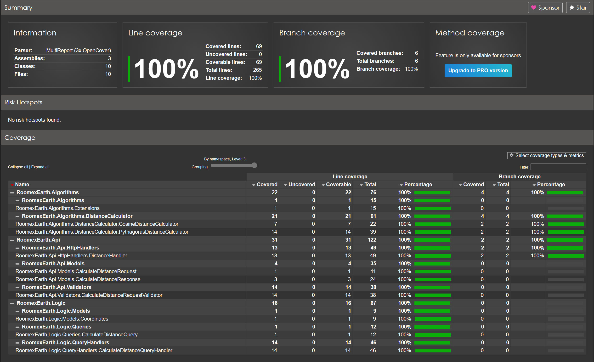

## Overview

The application is structured as follows:

* **RoomexEarth.Api** - This is a minimal API that provides a thin request handler with FluentValidation to guard against bad input before dispatching the query using MediatR. The choice to use MediatR instead of directly using the distance calculation algorithm interface is debatable. In such a simple project using the IDistanceCalculator directly in the request handler would have been fine but I chose to use MediatR as I believe it would be a more consistent choice if the API were to extend to include more functionality. Using MediatR provides a single dependency in the HTTP handler while decoupling the infrastructure from the logic.
* **RoomexEarth.Logic** - This is the domain logic providing the interfaces for the required algorithms and commands/queries as well as the handlers.
* **RoomexEarth.Algorithm** - This contains the implementations of the algorithm interfaces. It currently contains two distance calculation algorithms; cosine and Pythagoras.


## Build

The API may be built and run in a Docker container using the `RunBuild.ps1` script.
Once the API is running the script will perform a synthetic integration test sending known coordinates to the API and verifying the response.

This requires Docker to be running on the host.


## Challenge

When running in docker the [RoomexEarth.Api.http](RoomexEarth.Api/RoomexEarth.Api.http) file may be used to submit the request for the required coordinates, or the following link may be used:

http://localhost:48080/distance/from/53.297975/-6.372663/to/41.385101/-81.440440

The response gives the distance in km and miles:

```
{
  "distanceKm": 5536.338682266685,
  "distanceMiles": 3440.121355243082
}
```

## Benchmarks

The comparative benchmarks between the distance algorithms may be obtained by running the `RunBenchmarks.ps1` script
```
| Type       | Method                     | Mean      | Error     | StdDev    | Median    |
|----------- |--------------------------- |----------:|----------:|----------:|----------:|
| Cosine     | DistanceSameLocation       |  4.143 ns | 0.1113 ns | 0.3158 ns |  4.001 ns |
| Pythagoras | DistanceSameLocation       |  3.921 ns | 0.0788 ns | 0.0658 ns |  3.911 ns |
| Cosine     | DistanceDifferentLocations | 46.197 ns | 0.7121 ns | 0.5559 ns | 46.345 ns |
| Pythagoras | DistanceDifferentLocations | 88.629 ns | 1.4495 ns | 1.2850 ns | 88.396 ns |
```

As expected the PythagorasDistanceCalculator is slightly slower calculating the distance due to having more mathematical calculations to perform.


## Tests

Tests may be run using the `RunTests.ps1` script

Tests must pass with full coverage as part of building the docker image.

Tests are also run automatically for every commit to github.


